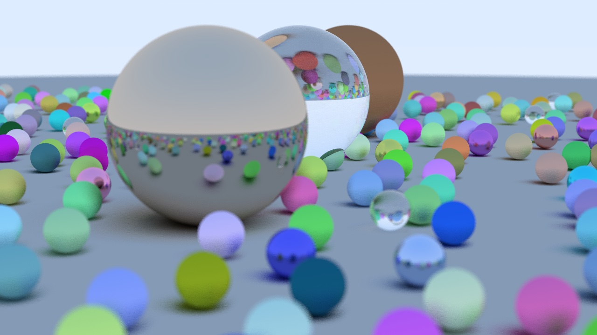

# Raytracer in Rust with WASM and Multithreading



This raytracer implements [Ray Tracing in One Weekend](https://raytracing.github.io/books/RayTracingInOneWeekend.html#thevec3class/vec3utilityfunctions) in Rust, with support for WASM targets and multithreading.

## Packages

### `raytracer-core`

This is the core library of the raytracer, and exposes enough to be able to
compose and render a scene in a thread-safe manner. It also includes some WASM
helpers that are included when the `[wasm]` feature is enabled.

### `raytracer-cli`

This is a CLI for the above that renders a test scene with 8 threads, and
outputs an image in PPM format over STDOUT.

#### Building

In the root directory:

```sh
$ RUST_LOG=debug cargo run --release > hello_world.ppm
```

### `raytracer-web`

This implements a WASM front-end for ray-tracer core, and renders a similar
test scene using a WASM binary.

#### Building

```sh
$ npm run build # supports --watch as well
$ npm start # starts an http-server to vend build artifacts
```

Open http://localhost:8080/ in a new browser tab to view the results.

Note- opening the page with dev tools open will _significantly_ slow down WASM
execution, presumably because the binary is not getting optimized at loadtime
when devtools is open. I recommend not opening dev tools until after loading
the page.